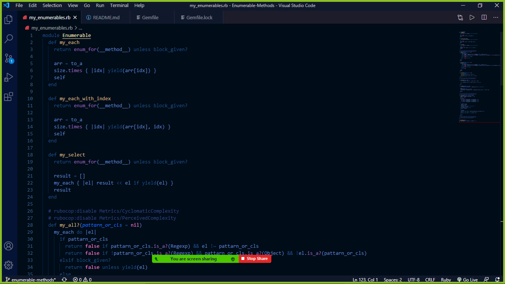

# Enumerable methods

> For this project, we created two **enumerable methods** used by the Enumerable module in Ruby.

## Short demo of the code

> We created the most used Enumerable methods with an extensive use of the Ruby methods, data types, loops and conditionals.

## Built With

- Ruby
- VSCode
- Rubocop

## Live Demo

To quickly see our project in action, visit the [live demo](https://repl.it/repls/LightgreenCautiousProgramminglanguage#main.rb) on repl.it.

## Getting Started

### Prerequisites

To get this project up and running, you must already have ruby installed on your computer.

### Installation

**To get this project set up on your local machine, follow these simple steps:**

1. Open Terminal.

2. Navigate to your desired location to download the contents of this repository.

3. Copy and paste the following code into the Terminal:

   `git clone https://github.com/mcihadkurel/Enumerable-methods`

4. Hit enter.

5. Once the repository has been cloned, navigate inside the repository and type:

   `ruby my_enumerable.rb`

   This will run the code, printing the output of our tests to the terminal.

6. To change those tests, simply open main.rb in a code editor and modify the values stored in the test_array and test_run variables.

7. Enjoy sorted arrays of data for the rest of your life.

### Tests

1. Open Terminal

2. Install RSpec on your system by running:

   `gem install rspec`

3. Run the tests with with the command:

   `rspec`

## Authors

👤 **Bello Babakolo**

- Github: [@belsman](https://github.com/belsman)
- Twitter: [@belsman](https://twitter.com/d_belsman)
- Linkedin: [@bello](https://www.linkedin.com/in/bello-babakolo-b23b17145/)

👤**Rick Oburu**

- Github: [@RICKCOYL](https://github.com/RICKCOYL)
- Twitter: [@rickcoyl](https://twitter.com/Rickcoyl)
- LinkedIn: [rick-oburu](https://www.linkedin.com/in/rick-oburu-8627591a4/)

## 🤝 Contributing

The best way you can contribute to this project to improve it is by submitting an [issue](https://github.com/belsman/Enumerable-Methods/issues)

## Show your support

If you've read this far, you must like the project! Give us a ⭐️!

## Acknowledgments

- This Project was part of an assignment available on The Odin Project.
- Our thanks to Microverse and all our peers and colleagues there.

## 📝 License

This project has no license
